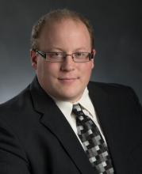
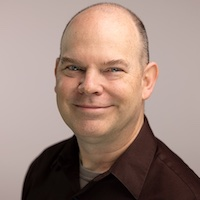
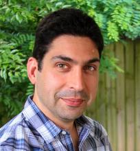

# About The MSU Cloud Computing Fellowship

The MSU Cloud Computing Fellowship is a cross-disciplinary program produced by MSU’s Institute of Cyber-Enabled Research (ICER) and the IT Services Analytics and Data Solutions (ADS) group for invited MSU doctoral students and postdoctoral researchers. As a part of this program, fellows will participate in a series of workshops during the fall semester to:

  * Determine the aspects of your research that can be accomplished with cloud computing;
  * Incorporate cloud-based systems into your research application or workflow; and
  * Understand the strengths and limitations of commercial cloud computing with the goal of improving research yield and minimizing cost, and to develop a workflow that utilizes that knowledge.
 
## Background

MSU doctoral students and postdoctoral researchers are invited to apply in the summer and approximately 18 are selected each year.  The program started in 2019.   If you are an MSU graduate student or post-doc and interested in participating next year, please check back in the Summer of 2022 for announcements on the invitation to participate, or request to join the [MSU ICER mailing list](https://icer.msu.edu/getting-latest-hpcc-updates)

## Citing the MSU ICER Cloud Computing Fellowship in Research Publications 

We encourage cloud fellows to acknowledge the fellowship in publications arising from computational work performed during your fellowship project. Please let us know that you have referenced the fellowship, and we will link to your publication on the ICER publication site, which will further increase the visibility of your work. A sample statement can be:  

"This work was supported in part through Michigan State University’s Institute for Cyber-Enabled Research Cloud Computing Fellowship, with computational resources and services provided by Information Technology Services and the Office of Research and Innovation at Michigan State University.”  
 
## Cloud Computing Fellowship Organizers

**Dr. Brian O'Shea** Professor and Director, MSU ICER 

*Role: Program Lead, ICER*

{ align=right } Dr. Brian O'Shea is a computational and theoretical astrophysicist studying cosmological structure formation, including galaxy formation and the behavior of the hot, diffuse plasma in the intergalactic medium and within galaxy clusters. He is also a co-author of the Enzo AMR code, an expert in high performance computing, and an advocate for open-source computing and open-source science. He received his B.S. in Engineering Physics at the University of Illinois in Urbana-Champaign (UIUC) in 2000, and his PhD in physics from UIUC in 2005 (with 2002-2005 being spent as a graduate student in residence at the Laboratory for Computational Astrophysics at UC San Diego and in the Theoretical Astrophysics Group at Los Alamos National Laboratory). Following that, he was a Director's Postdoctoral Fellow at Los Alamos National Laboratory, with a joint appointment between the Theoretical Astrophysics Group and the Applied Physics Division. Since 2008, he has been a member of the faculty at Michigan State University, with a joint appointment between the Department of Computational Mathematics, Science and Engineering (2015-present), the Department of Physics and Astronomy (2008-present), and the National Superconducting Cyclotron Laboratory (2014-present). From 2008-2015, Dr. O'Shea was a member of Lyman Briggs College. He has authored or co-authored over 75 peer-reviewed journal articles in astrophysics, computer science, and education research journals, and has received a variety of awards for his teaching and public outreach efforts. In 2016, he became a Fellow of the American Physical Society, and in 2019 he became the director of MSU's Institute for Cyber-Enabled Research.

**[Patrick Bills](mailto:billspat@msu.edu)**  Research Software Engineer, ICER 
*Role: Co-Instructor* 

{ align=right}  Pat Bills research background is in data systems for ecology (MS Entomology, MSU).  He has experience in database design, R, Python, and web application programming.  Pat has worked in research IT for over 25 yrs for departments and labs across MSU, including for MSU ICER as a high performance computing research consultant and trainer, for MSU Enterprise services as the technical lead of the data science team,   and currently as a research software engineer again for ICER. 

Like many, he has built and worked with on-campus linux systems for many years including the MSU HPC.  Pat started his cloud journey in 2017 during a workshop at the HPC conference where he saw [Ian Foster](https://scholar.google.com/citations?user=VGoSakQAAAAJ&hl=en) (our textbook author) present his vision of research on the cloud.  Since then he has used cloud services from Google, Amazon, and Azure  

  
**Dr. Mahmoud Parvizi**  Research Consultant, MSU ICER 
*Role: Co-Instructor*

{ align=right } Mahmoud earned his PhD in physics from Vanderbilt University with research in high-energy theory in the context of early universe cosmology as well as computational astrophysics. In addition, Mahmoud earned an MBA with a concentration in finance from the University of Michigan - Flint.  Mahmoud was formerly a postdoctoral research associate in the Department of Physics and Astronomy at Michigan State University with a focus on machine learning applications of cloud-computing workflows and currently a research consultant for the MSU Institute for Cyber-Enabled Research (ICER).   He participated as a cloud fellow in 2019 and co-instructor of the Cloud Computing Fellowship in 2020. 

Mahmoud’s diverse research interests include mathematical and theoretical physics, data-intensive astrophysics, machine learning for precision health, and cloud-computing platforms for academic research. His expertise includes 1) quantum field theory in curved/non-stationary spacetimes; 2) finite temperature quantum field theory and open quantum systems; 3) automated and end-to-end intelligent data pipelines for signal processing using compressed sensing and applied harmonic analysis; 4) machine learning and cloud-computing applications for precision health.

**Sponsored** by ICER, MSU Office of Research and Innovation (ORI), and Don DeRousseau, Directory of the MSU IT Services Research Cyberinfrastructure (RCI)
## Previous Cloud Fellows

**2019-2020**

  * [MSU Cloud Computing Fellows](https://icer.msu.edu/about/announcements/msu-cloud-computing-fellows)
  * [Summary of the first cohort of MSU Cloud Computing Fellows](https://icer.msu.edu/about/announcements/first-cohort-msu-cloud-computing-fellows)

**2020-2021**

  * Introducing the [2020 Cloud Fellows](https://icer.msu.edu/about/announcements/2020-msu-cloud-computing-fellows)
  * [20-21 Cloud Computing Fellowship Culminates in Impressive Symposium](https://icer.msu.edu/about/announcements/cloud-computing-fellowship-culminates-impressive-symposium)

  **2021-2022**

  [Introducing the 2021 MSU Cloud Computing Fellows](https://icer.msu.edu/about/announcements/introducing-2021-msu-cloud-computing-fellows)
  

  **2022-2023**

  [Introducing the 2022 MSU Cloud Computing Fellows](https://icer.msu.edu/about/announcements/introducing-2022-msu-cloud-computing-fellows)

  [4th Annual Cloud Computing Fellows Symposium](https://icer.msu.edu/about/announcements/4th-annual-cloud-computing-fellows-symposium)

