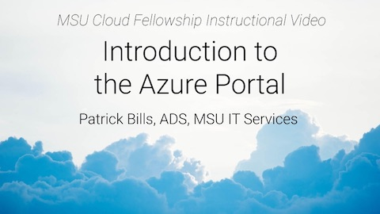
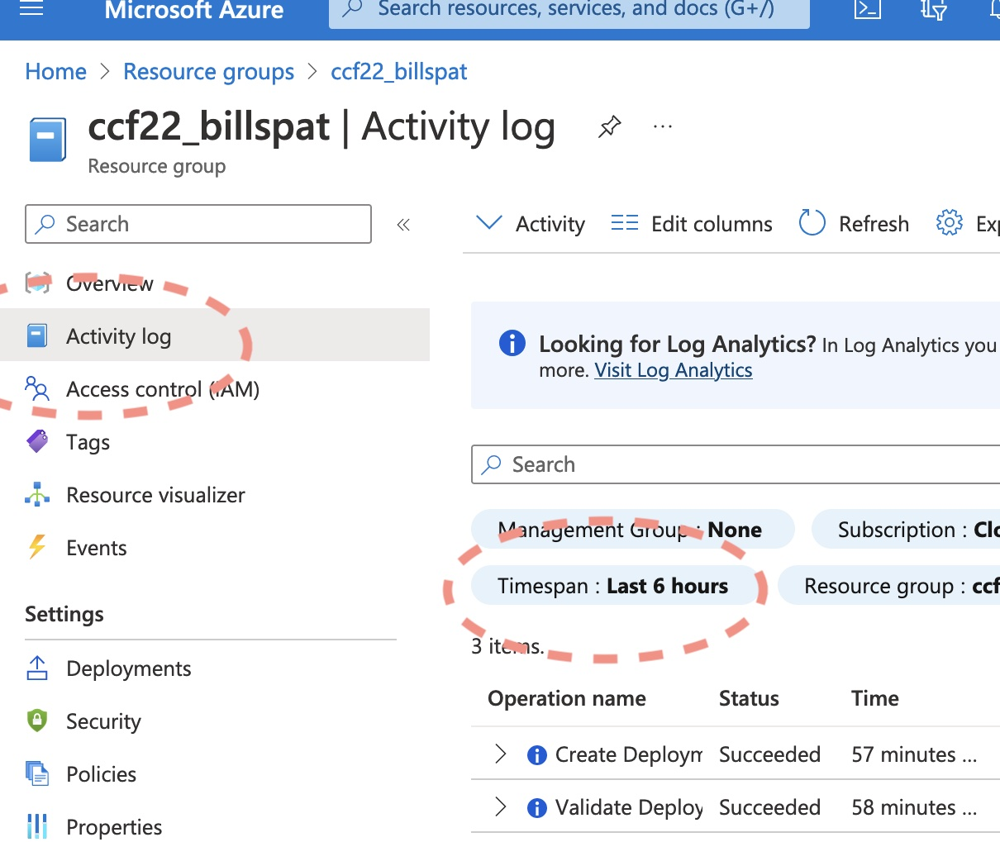

# Exercise: Azure Portal Walk-through and Storage account creation

from **MSU Cloud Computing Fellowship [Session 1](../sessions/01_introduction.md)**  

## About {align='right'} 

This is an exercise and introduction to the web interface to manage Microsoft Azure cloud services.   Prior to doing this exercise, please read  [Azure Organization](../topics/azure_organization.md) For more background on how azure is structured.   

For definition of terms used in this walkthrough , refer to our [Cloud Glossary](../cloud_glossary.md) 
including "[resource](../cloud_glossary.md#resource)", "[azure resource manager](#)" and "[resource group](../cloud_glossary.md#resource_group)"  or our [list of cloud references](../references/index.md) for introduction to cloud computing. 

For this activity we'll be using the web interface which Azure calls the "Portal" but that is only one of several ways to interface with Azure that we will learn about.   Many of the activities you can accomplish in the portal you can accomplish with the other (command line or code) interfaces. 

Azure's own overview of the Portal is here: https://docs.microsoft.com/en-us/azure/azure-portal/azure-portal-overview  Please refer to that as well as this material.  

There is a corresponding video that we've made that includes infrmation about the portal, and also creating a storage account.  

## Orientation to the Azure Portal

The link above is to a video that walks through the description and tutorial steps below, hosted on  MSU MediaSpace ( requires MSU Log-in).  Note this video also walks through creating a storage account.   

This assumes you have an Azure account and a valid subscription.   For the purposes of this introduction, we assume that your account currently does not have ability to create a new subscription, resource group, 

1. Log-in to https://portal.azure.com with your MSU Netid.   
    1. If you  are a current member of the fellowship and you have difficulty logging in, please [contact us](../contact.md) right away. 
1. orientation: dashboard view. 
   Azure portal first presents a "dashboard" which is organized into panels that show some aspect of your cloud account.  You may alter the panels on this dashboard  to show you the services and aspects of azure that are most important to you.   For information on how to create customize your dashboard, see "[Create a dashboard in the Azure portal](https://docs.microsoft.com/en-us/azure/azure-portal/azure-portal-dashboards)."    In the standard, default version of the dashboard the first panel is a list of resources.  If you have not created any resources yet you won't see anything.  We will explorer resources later in this introduction.   
   The standard dashboard panes are a list of your current resources (which may be in multiple resource groups), an advertisement with a link to learn about some new Azure service, and more links to create things the Azure has decided are most important to you.   We will focus on the "All Resources Pane"
   If you click on anything here you can almost always use the back button to get back to the dashboard, or use the menu (described below)
1. Top Bar Menu: the top menu ( three horizontal bars) is are links to many of the things also on the main dashboard. The "home" view is not the same as the dashboard but is a list of links to things Azure guess you may want to create, and a list of all of your resources.   If you click "resource groups" in this list, you should see only one resource group (if any) unless you've been added to others or a different subscription. 
1. Search bar: in the middle of the top of the screen is white box in which you can type search terms include the kind of resource you want to see or create, or part of the name of specific resource you've created.    This is what I use to create and find resources most of the time (and rarely use the links provided), more on that later. 
1. Shortcut buttons: the next few icons are short cuts to other functionality in the portal that we will cover in the future.  Most are not critical. 

1. A note about portal navigation:  When you click anything in the portal, it creates a new window without reloading the browser and with an **X** at the top right.  This mimics a "close window" function and You can use the X return to the dashboard, or you may simply use the menu and go to where you need to  

Notice that like most things there are 4-5 ways to get to anywhere.  

## Bonus: What can you do here?  

The primary purpose of using the portal and your resource group is to create things, and manage and monitor those things.   For the purpose of this activity - since you don't really have anything - we can simply look at the 'activity log' in the left side-panel near the top.  
   - this opens a new table of columns Operation name, Status, Time, Time stamp, etc that is probably empty for you.  
   - Tables of information like this in the portal have filters at the top.  The default activity is just for the previous 6 hours.   If you click on the Find that filter called "timespan" and select 1 week (or longer) you can see when I created the resource group and the budget.    
   

## Next Steps: Create a Storage Account

For a good follow up exercise, see [Creating a Storage Account with the Portal](./exercise_create_storage_account.md)

## About Portal "Resource" Pages

Most cloud resources in the portal have a list of categories on the left side, and pages for each category in the center.  The first page is the "Overview"  which has the resource group, subscription, and other info important for that resource.   this followed by the "Activity Log" showing how the resource has been used.   Each of the following items on the left side is a new page of additional options to alter how the resource is configured.  For example if you click the "tags" section you see the tags you added (if any) and can modify or add new tags. 
   
Some of the options are not available on the forms when you create the resource, or the names of the options on these resource pages do not match the forms when you created the resources.   In that case you may have to use two steps to configure the resource as you like, or better consider using a programmatic [interface](../topics/intro_to_cloud_interfaces.md)

Again we did not discuss any of the characteristics of cloud storage or how to use it but you should now have enough familiarity with the azure portal to follow other tutorials to create and use storage or other resources.  

