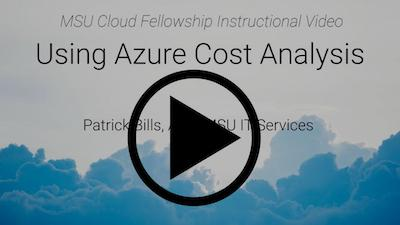

# Intro to Cloud Costs on Azure

You've heard us say that nearly everything Azure has a cost, but how can you tell how much? 

*First, Cautionary Tale*: [Google Cloud Charged Me $1000 For This Mistake](https://medium.com/@ikunalv/google-cloud-charged-me-1000-for-this-mistake-25a313412a1f) by Kunal Vaidya on Medium.   *tl;dr: he forgot to turn off a service even though he was no longer using it.   Good news it, Google does grant 1-time forgiveness if you can prove you are using the service to learn about it (e.g. you are student). *

## Video Walk-through of Azure Cost Analysis
The following video walks through how to use the costs analysis features of the Azure portal for your resource group.   
    1) It helps to understand [Azure Organization](#), and 
    2) it is from a few years ago so the screens may look a little different

 

*Short video (3:30) Demonstrating Azure Portal Cost Analysis, on MSU MediaSpace (log-in required)*

## Details about Costs in Azure

The content below assumes you have knowledge of how to use the Azure Portal, basic cloud operations, what a virtual machine is. See the links and materials for [session 01](../sessions/01_introduction.md) for the necessary background. 

### 1. Pricing Pages. 

All cloud vendors have pricing pages that describe how they meter and charge for services.  For Azure this is https://azure.microsoft.com/en-us/pricing/#product-pricing

However I usually find the page I need quickly by simply googling `azure <service name> pricing` for example I wanted to see how much a static IP address costs in azure so [googling 'azure static ip pricing'](https://www.google.com/search?q=azure+static+ip+pricing) takes me to https://azure.microsoft.com/en-us/pricing/details/ip-addresses/

Some of these pages are  straightforward, but like the one above has addition knowledge.  What does this mean in practice?  For example, what does "classic" vs "ARM" even means? There is a link at the top of the page but this may take time to read and understand.  I'll tell you that we will never use 'classic' and only use 'resource manager (ARM).' so look at the ARM Prices.

This kind of background info is very common for services.  

### 2. Build something and check the cost

The other option is the empircal method: build something, use it, review the costs, and estimate.  

At the resource group in the protal ( see  [Azure Organization](./azure_organization.md)), there is a link on the left-side menu, near the bottom labelled "Cost Analysis"   - click that

This is a live report of your current costs, with the ability to filter by time period, resource type, tags, and other things.   

Near the middle are rouded buttons controlling the view you see.   At the right side of this is a button "Add Filter"  which you can click to show costs only for some resources.  For example if you click that and select "Service Name" and then "virtual machines" you will see the costs for the current month. 

A powerful filtering technique is to use tagging in Azure, which is akin to adding meta-data to resources.   See the [Cloud Glossary](../cloud_glossary.md#tags) 

In many of the filtering mechanisms in Azure (including costs), the tag names (keys) use use are listed in the options for filtering.    

Carefully select the date range for which you want an estimate, especially if your trial run started a few days ago in the previous month as the default is a monthly estimate.  Use a custom date range for the time period that makes sense for the costs you want to observe. 

*Example Azure Cost Analysis Screen, filtered by Tag.  Click for larger view*

### 3. Pricing Calculators

All the cloud companies have pricing calculators and they may be good for very rough estimates but I always multiple by 1.2 as I'm sure I missed some crucial resource that I didn't know I needed or didn't know costs money.  

For Azure it's https://azure.microsoft.com/en-us/pricing/calculator/

## Summary and other notes

Combining these three methods is how we can estimate costs. 

Notes: 

* Pricing often depends on the location or region you select.  Most regions in the US are the same price.   

* Data transfer costs are really hard to estimate.   Transfer into the cloud (Ingress) is often free but out of the cloud (egress) usually has a charge.  This is because companies with web products *(e.g. websites, web stores, image sites, etc) make money when customers view their pages (more customers => more costs =>but more revenue).  However note that MSU has a deal with Azure and data transfer from Azure to MSU is (mostly) free.   One way to mitigate data transfer costs in Research is to transfer large data inputs into azure, but only take out the smaller output (results, summaries).  

## Azure Pricing Resources

[Quickstart: Explore and analyze costs with cost analysis](https://docs.microsoft.com/en-us/azure/cost-management-billing/costs/quick-acm-cost-analysis)

Video from John Saville on cost estimation including the pricing calculator: [Master the Azure Pricing Calculator Jun 17, 2021](https://www.youtube.com/watch?v=rMKmbZ1SYQg)

