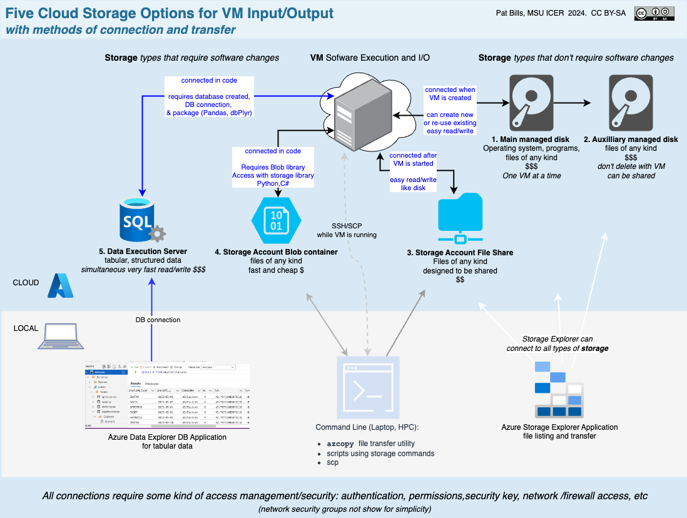

---
title: Storage and data transfer options for VM
---

# Storage and data transfer options for VM

*From [Session #3, Cloud Storage](../../sessions/03_cloud_storage.md)*

  

[Full size image](Five_storage_options_for_cloud_vm_to_local_file-date_sharing.drawio.png)

Links: 

- [Azure Storage Explorer](https://azure.microsoft.com/en-us/products/storage/storage-explorer/) User application for moving data down from and up to Azure cloud storage including disks
- [the azcopy utility](https://learn.microsoft.com/en-us/azure/storage/common/storage-use-azcopy-v10), a command-line utility for moving data to/from your computer to the cloud, or from cloud-to-cloud.   To access Azure Storage accounts
  you must create and use a special URL that includes a Security Key (a "SAS" key in Azure terms).   
- [Azure Data Studio](https://learn.microsoft.com/en-us/azure-data-studio/what-is-azure-data-studio),   a cross-platform application for interacting with databases.  Designed for Micrsoft's branded "SQLServer" but works with many open source databases.  Requires an existing database in the cloud or elsewhere.  There are many open source versions of this kind of database user-interface application: [List of database GUIs](https://www.eversql.com/top-7-mysql-gui-tools-for-windows/)
- [Quickstart: Azure Blob Storage client library for Python]( https://learn.microsoft.com/en-us/azure/storage/blobs/storage-quickstart-blobs-python?tabs=managed-identity%2Croles-azure-portal%2Csign-in-azure-cli)

Unfortunately the [R libraries that worked with various Azure services](https://github.com/Azure/AzureR) have not been worked on for several years and there is no guarantee they will work.   [AzureStor](https://github.com/Azure/AzureStor)

